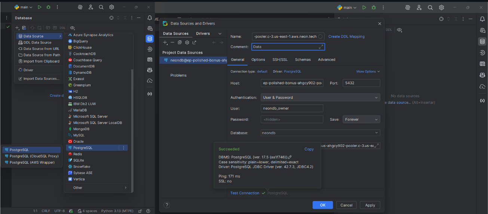
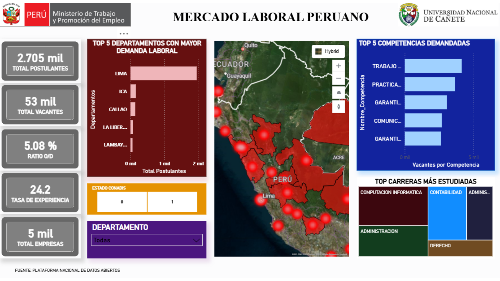

## El Reto

El Ministerio de Trabajo del Perú publica datasets valiosos sobre oferta y demanda laboral, pero los datos presentaban problemas críticos:

*   **Sin validar ni limpiar**: Duplicados, inconsistencias, valores nulos
*   **Sin modelo dimensional**: Imposible realizar análisis multidimensional
*   **Falta de métricas**: Sin KPIs consolidados para toma de decisiones

## Mi Rol 

**Responsabilidades:**
*   Diseño completo de arquitectura dimensional (modelo constelación)
*   Desarrollo del pipeline ETL en Python
*   Integración con NeonDB (PostgreSQL cloud)
*   Creación de dashboards en Power BI

## Enfoque

### Fase 1: Análisis y Diseño Dimensional 

1.  **Análisis de datos fuente:** Exploré 6 datasets del MTPE (postulante, educación, experiencia, vacantes, competencias, discapacidad) con **55K+ registros**
2.  **Identificación de procesos de negocio:** Oferta de talento vs Demanda laboral
3.  **Diseño del modelo constelación:** 2 estrellas para análisis multidimensional

### Fase 2: Pipeline ETL Robusto 

Implementé una arquitectura de 3 capas con **Python en PyCharm**:

**Capa RAW:** Preservación de datos originales (6 CSV) sin modificación para auditoría

**Capa CLEANED:** Scripts Python para:
*   Validación de tipos de datos
*   Deduplicación de registros
*   Normalización de strings
*   Tratamiento inteligente de nulos

**Capa INTEGRATED:** Transformación a modelo dimensional con:
*   **8 dimensiones:** tiempo, ubicación, postulante, carrera, institución, vacante, empresa, competencia
*   **5 tablas de hechos:** postulante, formación, experiencia, vacante, competencia_requerida

### Fase 3: Implementación Cloud y Visualización 

*   **Infraestructura:** Implementación en **NeonDB** (PostgreSQL serverless) para escalabilidad
*   **Visualización:** Dashboard interactivo en **Power BI** con KPIs clave
*   **Documentación:** README completo con arquitectura y guía de uso

## Insights Clave Descubiertos

*   **76% de postulantes sin experiencia laboral** → Necesidad crítica de programas de primer empleo
*   **Lima concentra 66% de vacantes** → Centralización extrema del mercado laboral
*   **Ratio oferta/demanda: 5% (1:19.7)** → Escasez crítica de talento calificado
*   **Top 3 carreras:** Computación, Contabilidad, Administración
*   **9,522 competencias únicas demandadas** → Alta fragmentación de requisitos laborales

